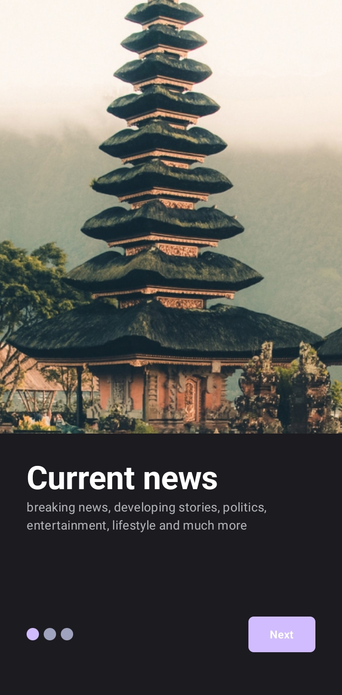
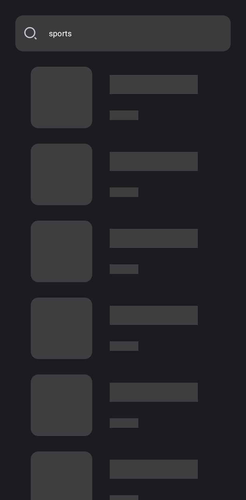

##introduction

An Android app consuming [News API]("https://newsapi.org/v2/") to display News lists 
built with Jetpack Compose,Clean Architecture Principle, MVVM pattern,MVI pattern as
well as Architecture Components.

# 🛠️Adding to room  🛠
# 🛠️Finalizing... 🛠

## App
The app loads the the News from the api and displays them in a list. When the list is clicked the
app navigates to the Details Screen which shows more details.
The search functionality is also present
.
## Prerequisite.
 To run the application you'll need add your api key in gradle.properties file. 
 Generate your api key by [creating]("https://newsapi.org/v2/") an account at ("https://newsapi.org/v2/").

## Screenshoots
These are the app's screenshots:

 &nbsp;&nbsp;&nbsp;&nbsp;&nbsp;&nbsp;   |

 &nbsp;&nbsp;&nbsp;&nbsp;&nbsp;&nbsp;  |

 &nbsp;&nbsp;&nbsp;&nbsp;&nbsp;&nbsp;  |

## Clean Architecture

